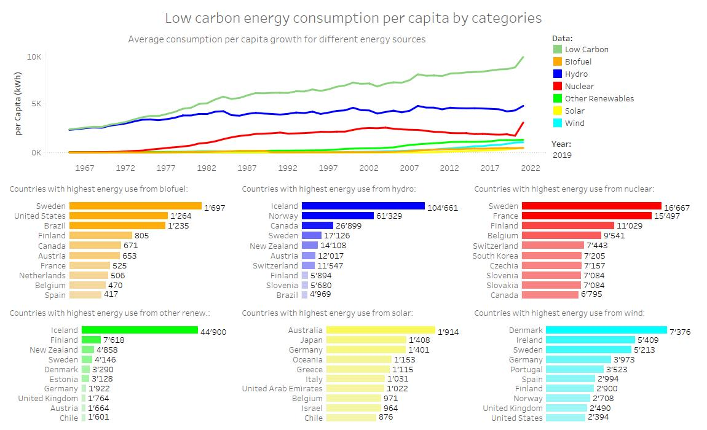
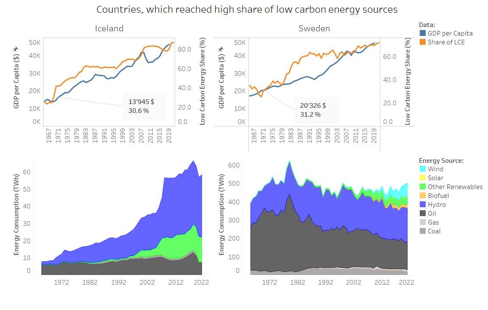
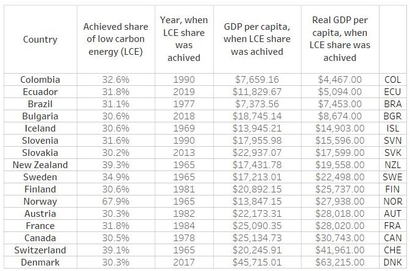

# energy-carbon-footprint

# Visualization project for “Data Visualization with Tableau” specialization
&emsp; In order to receive specialization, I needed to make my own project for the last course of “Data Visualization with Tableau”. Theme of my project was “Energy and carbon footprint”. Dynamic visualization available on Tableau Public website [here](https://public.tableau.com/app/profile/lina5637/viz/Project_energy_climate/Energyandcarbonfootprint). I want to show here, how the project was created step by step.

## Preparations *(steps and course tasks to create a project)*  
&emsp; The first task in the project was to write a proposal, where I would need to write summary, and answer questions like “Why?”, “Who?” (also creating a Persona), “What?”, “How?” and describe expected challenges.

---
### Project Proposal
#### Executive Summary
&emsp; For this project, I decided to take topic that is of great interests for me. In my former profession I was a HVAC Civil Engineer, and I was always interested in alternative energy sources and energy efficient technologies. Nowadays, when deciding on an energy source, some questions like “Does it produce a lot of emissions?” “Is it climate friendly?” might arise.  It’s very important to minimize CO2 emissions, as it directly affects climate change. This project will investigate countries’ emission profiles, energy sources, and look closer into some countries, that achieved higher share on low-carbon energy sources.
#### Why
**Goals:** Investigate countries’ energy consumption and carbon footprints, analyze some countries GDP, population and energy sources development  
**Intended outcome:** find a pattern (what are the factors, when country switches to alternative energy sources) and make a prediction, which countries could improve carbon footprint now
#### Who
**Stakeholders** – me (it is my personal project on this subject, that interests me)  
**Audience** – anyone, who is interested in climate change and energy consumption topic  
**Quantitative Audience Snapshot:** on average 64% of people care about climate change in all age groups, where younger people are more engaged (69%). By 4% more males are interested in the topic, than females (M/F: 52%/48%). People, who have experienced post-secondary education make up the biggest target group[^1].  
**Qualitative Audience Snapshot:** Persona 1: John

  

#### What
**Data Source:** “Data on Energy”[^2] by Our World in Data  
**Data Quality:** CVS format, expected to be ready for use (cleaned)  
**Data Timeliness:** Last update was on August 9, 2022  
**Reason to choose this dataset:** All data produced by Our World in Data are completely open access under the Creative Commons BY license. Data is regularly updated; names and units are standardized. Data is provided for most countries in the world.   
#### How
**Format:** story format dashboards created in Tableau  
**Presentation:** could be viewed on any electronic device  
#### Challenges
I expect following challenges:
1.	I need to create a story, that can be understandable by people without necessary education;
2.	I might find no pattern;
3.	In analysis, I might need more information, that dataset has; 
4.	Topic is very complex, and within the project I can’t look at it from every angle. So, I’ll have to decide on which part to focus.
---

&emsp; During the implementation of the project, I was right about expected challenges – I used 3 more datasets, found pattern could not be used to make prediction, and while analyzing carbon footprint data, I had to focus on data that is connected to energy usage.  
&emsp; The next step in the course was data cleaning. I hoped, that dataset is ready to use, but I always check data for incorrect calculations, missing data and outliers. Also, in the cleaning process I remove all unnecessary data, that won’t be used in calculations, analysis and visualization.
---
### Data cleaning and importing
**Cleaning process of the main dataset**
1.	I removed all unnecessary columns. I removed data that is not about energy consumption – information about production and electricity; 
2.	This dataset has a lot of premade calculations, but does not have any formulas. So, my next step is to do the calculations by myself, and check them against the provided data. Due to data rounding, I’ll allow 5% difference. Calculations made:
      *	Fossil fuel consumption should equal to sum of coal, gas and oil consumption  
           *	Founded outliers: Missing data on Turkmenistan on fossil fuel after 1997 year, and Iraq for 2021. Solution: to add calculated data myself, because all needed data for calculations are available;  
      *	Renewables consumption should equal to sum of hydropower, biofuel, solar, wind and other renewables consumption
           *	No outliers;
      *	Low carbon energy consumption should be equal to the sum of nuclear, hydropower, biofuel, solar, wind and other renewables consumption
           *	No outliers;
      *	Energy data per capita should equal to primary energy divided on population data and multiplied by 109 (TWh -> kWh)
           *	Founded outliers: Data on Yugoslavia is not complete. Solution: Remove this country from dataset, because of insufficient data and also this country doesn’t exist anymore;
3.	Analysis of missing data:
      *	Regional data missing lots of values, so it can’t be used for analysis by different regions. Solution: remove region data, as most of it can’t be analyzed by energy source;
      *	Lots of countries don’t have information about energy consumption for years before 1950-1980. Solution: remove unnecessary rows, as they don’t provide any data;
      *	164 rows don’t have the most current data, for the years 2020 and 2021. Solution: limit the analysis till the 2019 year, use 2020+ for single country analysis; 
      *	Rest of the missing data is normal, because not all countries use all described energy sources, so there are NULL values.
---
&emsp; As I mentioned before, later in analysis I needed more information, so I used 3 more data sets, and they also needed to be prepared.  

**Second dataset:** “Data on CO2 and greenhouse gas emissions”[^3] by Our World in Data  

**Cleaning process**
1.	I removed all unnecessary columns and rows. I only need data about CO2 emissions in absolute numbers and by category. I removed all regional data. I limited data to start from 1990, as it doesn’t have NULL values;
2.	This dataset also has a lot of premade calculations, but I need to check only for data, that would be used. Calculations made:
      *	CO2 emissions should equal to sum of CO2 emissions from cement production, coal, gas and oil usage and flaring
           *	No outliers

**Third dataset** about trade I created by combing export data[^4] by year for China  

**Cleaning process**
1.	I removed all unnecessary columns, that won’t be used in visualization. I also removed all regional data; 
2.	There are no missing values;
3.	Some country names were different from the main dataset, so I changed them to be consistent in order to link geographical data in Tableau.

**Fourth dataset** I used data from one of the data sets and enriched it with necessary information about countries’ real GDP  

**Creating process**
1.	I filtered main dataset, to show me the countries, which achieved at least 30% share of low-carbon energy; took information only about the first year the share was achieved, or, in two cases, data on the first available tracking year. Data from the main dataset that was also used was GDP and population data;
2.	Using GDP and population data, I calculated GPD per capita;
3.	I can’t compare data from different years, because there of inflation, and purchasing power for same amount of money is different for 1965 and 2010. To compare data, I added real GDP data for the given year[^5].

**The next step is to import data:**
1.	Country names assigned to geographic role as “country/region”;
2.	“Year” column assigned as “date”;
3.	All datasets linked to one another via “country” and “year” columns;
4.	Number format for share (percentage) and currency data are changed accordingly;
5.	Manually added country geographical data, where its missing in Tableau.
---
### Design principles 
Course task was to explain my use of pre-attentive attributes:  
* Having lots of data means that I need to keep it as simple as possible, so that the different data visualizations could be understandable; they should not overwhelm dashboards with complicated designs;
* I need to be consistent with colors throughout the whole project;
* I picked colors to be intuitive understandable, like red for “bad” range of data and green for “good”;
* I tried to use colors, that are associated with something when possible. For example, I allocated yellow color for solar energy, blue for hydropower;
* Colors also show the grouping of data, like colorful for low carbon energy sources data, and black and grey colors for high carbon energy sources data;
* Adequately amplifying the contrast, so the chart could be understood instantly, but not making it misleading;
* Used color gradients for data.
---
## Analysis  

*By clicking on the image, you are redirected to the dynamic visualization on the Tableau Public website*  

---

### Introduction

&emsp; Climate change is a concern for all of us, and impact of it could be seen in different sectors. Drought can harm food production and human health. Flooding can lead to disease spread and damages to ecosystems and infrastructure. Untypical weather brings harm to animals.  
&emsp; One of the ways to fight climate change, is to lower our carbon footprint. Carbon footprint is the total amount of greenhouse gases (like CO2), generated by our activities. For this research, Ill focus on countries energy sources.   

Data, that going to be explored:
1.  Countries energy source data by different parameters; 
2.  CO2 emissions; 
3.  Will take a closer look to the countries, that reached at least 30% of its energy share with low carbon sources; 
4.  Explore, if country economic status (GPD) impacts its use of energy sources.

*What is low carbon energy?*  

&emsp; Low-carbon energy is energy, that is generated using lower amounts of carbon emissions, such as wind, solar, biomass, hydro or nuclear power. Therefore, coal, oil, natural gas and other fossil energy are high-carbon energy.  

How much CO2 emissions produced to make 1 TWh of energy: 
* From coal:  986 000 tons of CO2 
* From oil: 777 000 tons of CO2 
* From gas: 429 000 tons of CO2 
* From hydro power: 24 000 tons of CO2 
* From nuclear power: 15 000 tons of CO2
---
### Territorial emissions of carbon dioxide (CO2) and it trends
Map shows how high each country generates CO2 emissions:  
   

&emsp; We can see the top 10 countries that produce most of world’s emissions. China, which takes first place and produces largest amount of emissions, produces alone as much as next in the top four countries combined.  
&emsp; In the graph, we can see the correlation between GPD growth and amount of emissions. Larger GDP leads to larger yearly emissions. This means that countries that are developing manufacturing, should try to use low carbon energy sources for new developments, as well as modernize old ones. Strives for a growing economy should not impact the world and change climate.  
&emsp; Not always goods produced in the country stay there, some of them are exported. Nowadays companies move production to countries, where it could be done significantly cheaper. This means that CO2 emissions could be imported/exported with the goods.   
---
### Emissions of carbon dioxide (CO2) embedded in trade  
The map shows the import/export of CO2 emissions:  
    

&emsp; This map shows CO2 emissions embedded in trade, which is the amount of CO2 that is imported or exported via traded goods with other economies. A positive (“red”) value means, that a country is an importer of CO2 emissions; a negative (“green”) value indicates a country is an exporter of CO2. A lot of companies use China for its goods production, thus making China the highest exporter of CO2 emissions. USA is the highest CO2 emissions importer, while it also takes the second place in the amount of CO2 produced on its own territory.  
&emsp; Bar chart shows the share of countries import coming from China. In 2019, 86 countries had more than 50% of its import from China. This mean that world depends on China production, and it should consider investing in climate friendly technologies there.  
---
### Emissions of carbon dioxide (CO2) by categories  
The graph shows how high are CO2 emissions from different sources:  
  

&emsp; 1 MWh energy from coal produces the largest amount of CO2 emissions; use of coal was rapidly growing for last 20 years. China uses coal for the vast majority of its energy needs, and for the last 20 years coal usage tripled there. USA is the leading CO2 emissions produced from oil and gas. Both countries should minimize use of coal and oil by switching to low carbon alternatives. Furthermore, they should try to use gas in the transition period, if possible.  
&emsp; Adjusting CO2 emissions for trade, didn’t change first six countries position on the top of largest emissions producers. For China, trade CO2 is less than 10% of all emissions produced. While making production of goods climate friendly is important, large amount of energy is used for peoples’ everyday life. We need energy for heating and/or cooling buildings, for cooking, to produce electricity and etc. This means, that country’s needs for energy depends on the size of population to a great extent.  
---
### Worlds energy consumption data  
This dashboard shows worlds energy consumption profile:  
   

*Individual country energy consumption profile could be seen on Tableau website using filter or clicking on the country on the map.*  

&emsp; It’s important to look at both absolute and "per person" data. From the chart on the bottom we can see that per capita energy consumption doesn’t change a lot, while in absolute numbers our need for energy growth explosively.  

---
### Share (%) of low carbon energy   
Map shows utilization of low carbon energy:  
   

&emsp; This board shows, that only a few countries achieved considerable share of low carbon energy. Some of these countries will be analyzed later in the project.  
&emsp; Building low carbon energy source infrastructure used to be linked to high expenses that not all countries could afford. The graph shows no correlation between GDP size and countries share of low carbon energy, meaning that having powerful economic situation doesn’t lead to developing climate friendly energy sources.  
---
### Low carbon energy consumption per capita by categories  
Graph shows energy consumption data by its source:  
    

&emsp; As we can see, while all low carbon sources energy use was growing, nuclear energy was declining for more than a decade, until only in a recent year it changed.  
&emsp; Biofuel is derived from biomass (plant or algae material or animal waste) and is most commonly used in countries with large agriculture lands. In Sweden it is recycled wood, in USA it is corn and in Brazil it’s sugarcane.  Countries with rivers, especially steep ones, located in the mountains, tend to utilize hydropower. Iceland uses meltwater rivers flowing off massive glaciers, Norway makes use of heavy rainfalls in steep valleys, which leads to high levels of running water in rivers and waterfalls, Canada built dams around large water reservoirs. Nuclear plants are often built in countries with low seismic activity like France, Finland and Switzerland. Sometimes, countries located in active seismic area, like Japan, also build nuclear plants, but use a lot more plant protection to withstand earthquakes. Unfortunately, sometimes safety measures fail, so the government needs to make a well-thought-out decision to build a nuclear plant. Iceland is very known for its hot springs, and makes a good use of geothermal energy, where approximately 85% of all houses are heated with such energy. Solar energy efficiency depends on many various factors, like latitude, temperature, shading from clouds and etc. Lately, the development of batteries that became more capacious and cheaper made solar panel application wider. Broad use of solar panels could be seen in countries located close to equator, like Australia, Oceania and United Arab Emirates. Wind energy is also very depended on geographical location, where wind farms should be located in the windiest places possible, to maximise the energy they create. Generally, it’s large open plains, tops of the hills and mountain gaps, and also offshore in the sea. Denmark has average wind availability onshore, but having access to the sea, it had setup large offshore wind farms, producing more than 40% of all electricity needs. Ireland, having more than 300 wind farms onshore, provides more than 1/3 of its electrical demands with wind power. To sum up, application of low carbon energy sources depends on country’s geographical profile, and governments should make detailed evaluations, as to which technology would be the most efficient in their country.  
&emsp; Next, we will look closer to countries, who achieved at least 30% of low carbon energy share.  
---
### Countries with high share of low carbon energy sources  
   

&emsp; Norway and Switzerland had high share of low carbon energy from the start of this dataset’s tracking period, so it can’t be linked to the growth of GDP per capita. Norway is a good example of government choices for climate friendly energy. While having large oil and natural gas reserves, Norway mostly uses hydropower as the primary energy source.  

---
### Countries, which reached high share of low carbon energy sources  
    

&emsp; In last 50 years Iceland and Sweden developed their energy system, so that more than half of their energy would come from low carbon energy sources. Iceland reached the highest share in the world (86,9%) in the past few years. We can see the correlation of economic progress (GDP) and growing share of climate friendly energy sources.  

---
### Large countries  
  

&emsp; Large area countries have more challenges with energy infrastructure, their energy delivery system needs to be significantly larger; it is especially challenging to deliver energy to remote areas. For small area countries main expenses are related to building energy production sites. For larger countries it’s both – production and delivery of energy. Maintenance of larger infrastructure also takes more resources. It could be a reason that correlation between GDP growth and share of low carbon energy sources is less significant for these countries.  

--- 
### Average countries, which reached 30%+ low carbon energy share  
   

&emsp; This dashboard shows average case of countries, which develop their country energy system by growing its share of low carbon energy. We can see a correlation, that economic expansion helps increase share of low carbon sources energy.  

---
### Countries with relatively lower GDP  
  

&emsp; Countries like Ecuador and Colombia don’t have as strong of an economy, as countries we looked at before, but they still managed to achieve more than 30% share of low carbon energy sources. That means that in order to make changes for the climate and the world, countries don’t always need a thriving economy. So, these countries have insignificant correlation between GDP and share of low carbon energy sources.  

---
### Does going for climate friendly energy depends on country economic level (GDP)?  
This table shows the year, when country reached at least 30% share of low carbon energy (for Norway and Switzerland its first data tracking year) and how high was its GDP per capita.
   

&emsp; At the first glance I could assume, that having growing economy of 17.000-22.000$ GDP per capita would be one of the factors for developing low carbon energy source system, but I can’t compare data from 1965 and 1981, because of inflation: its buying power differs.  
&emsp; To compare data from different countries and over time, I need to use Real GPD economic measure. Real GDP per capita is a measurement of the total economic output of a country divided by the number of people and adjusted for inflation.  
&emsp; Data shows, that there is no correlation between countries economic strength and its application level of low carbon energy source systems. It could be done and with strong economy like in Denmark, and with relatively small GDP like in Colombia.  
---
### Conclusion 
1. There is no economic level (GDP) to be reached for country to start investing in low carbon energy sources. So, no one should wait for its economy to grow, to start changing its energy sources.
2. With a relatively low GDP, countries tend to invest in hydro power.
3. There is a correlation between growing share of climate friendly energy use and growing GDP. On average, when LCE share grows, then the GDP is also growing, but it does not work the other way around, because the use of different sources depends on countries energy decisions/politics.
4. China is bearing large share of worlds goods production, lots of countries have more than 50% of their import from China. So other countries, that have production in China, should consider investing in low carbon energy sources there, because it would benefit the whole world.
5. Due to limits of technologies, it is impossible to produce all necessary energy using renewables sources, like wind and solar, at least for now. Countries, switching from high carbon energy sources to low, might consider using hydro and nuclear power.
6.  We need to minimize the ever-growing use of oil and coal energy, as they are still used to produce the largest part of the world's energy, but emit CO2 at almost the double rate as compared to natural gas.

---
### Sources:
[^1]: “The Peoples' Climate Vote” United Nations Development Programme, January 26, 2021, https://www.undp.org/publications/peoples-climate-vote  
[^2]: “Data on energy” by Our World in Data, version from August 9, 2022, https://github.com/owid/energy-data    
[^3]: “Data on CO2 and greenhouse gas emissions” by Our World in Data, version from September 6, 2022, https://github.com/owid/co2-data  
[^4]: “China Exports by country and region” by the World Integrated Trade Solution (WITS), https://wits.worldbank.org/CountryProfile/en/Country/CHN/Year/2020/TradeFlow/Export  
[^5]: “GDP Per Capita (Real)” by World Economics, https://worldeconomics.com/Indicator-Data/Wealth/GDP-Per-Capita-Real.aspx  
[^6]: “Icelandic króna” by Wikipedia, version from November 21, 2022, https://en.wikipedia.org/wiki/Icelandic_kr%C3%B3na   

